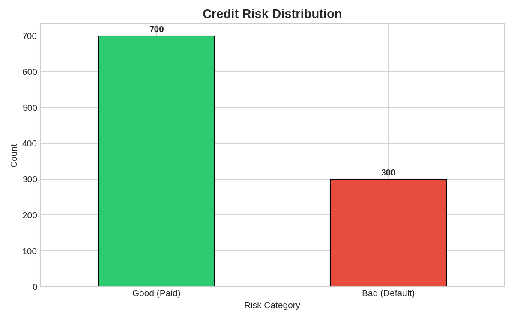
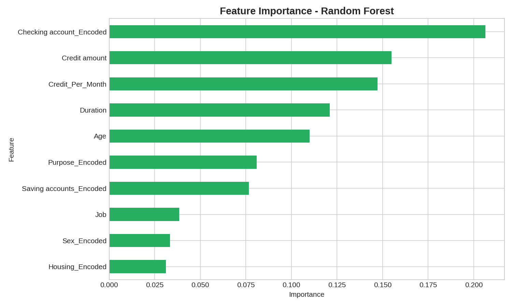
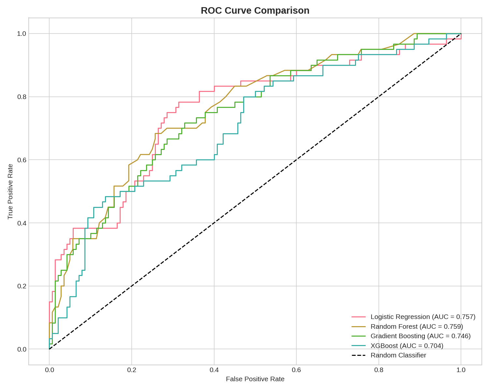

# 🏦 Credit Risk Prediction System

A machine learning project for predicting credit default risk using the German Credit Dataset. This project demonstrates end-to-end data science workflow including EDA, feature engineering, model building, and deployment.


##  Project Overview

Credit risk assessment is crucial for banking institutions to minimize loan defaults. This project builds a machine learning model that predicts whether a customer will default on their credit, enabling better lending decisions.

### Key Features

- **Exploratory Data Analysis (EDA)** - Comprehensive analysis of customer demographics and credit patterns
- **Feature Engineering** - Creation of meaningful features to improve model performance
- **Model Comparison** - Evaluation of multiple ML algorithms (Logistic Regression, Random Forest, Gradient Boosting, XGBoost)
- **Credit Scoring System** - Custom scoring system (0-1000) with risk categories
- **Interactive Dashboard** - Streamlit web application for real-time predictions

##  Dataset

**German Credit Risk Dataset**
- **Source:** UCI Machine Learning Repository
- **Samples:** 1,000 customers
- **Features:** 10 attributes including age, job, housing, credit amount, duration, purpose
- **Target:** Risk (good/bad)
- **Default Rate:** 30%

##  Methodology

### 1. Data Preprocessing
- Handled missing values in 'Saving accounts' (18.3%) and 'Checking account' (39.4%)
- Encoded categorical variables using Label Encoding
- Created new features: Age groups, Credit groups, Credit per month

### 2. Class Imbalance Handling
- Applied SMOTE (Synthetic Minority Over-sampling Technique)
- Balanced training set: 560 good, 560 bad

### 3. Models Evaluated

| Model | Accuracy | Precision | Recall | F1-Score | AUC-ROC |
|-------|----------|-----------|--------|----------|---------|
| **Random Forest** | 72.5% | 54.2% | 53.3% | 53.8% | **0.7585** |
| Logistic Regression | 71.0% | 51.3% | 65.0% | 57.4% | 0.7570 |
| Gradient Boosting | 70.5% | 50.7% | 58.3% | 54.3% | 0.7456 |
| XGBoost | 70.5% | 50.8% | 50.0% | 50.4% | 0.7043 |

### 4. Credit Scoring System

| Score Range | Category | Risk Level |
|-------------|----------|------------|
| 750-1000 | Excellent | Very Low |
| 650-749 | Good | Low |
| 550-649 | Fair | Medium |
| 450-549 | Poor | High |
| 0-449 | Very Poor | Very High |

##  Key Findings

1. **Checking Account Status** is the strongest predictor of default
2. **Higher credit amounts** correlate with increased default risk
3. **Longer loan durations** tend to have higher default rates
4. **Purpose matters:** Vacation and "other" loans show highest default rates
5. **Age effect:** Younger customers (< 25) show slightly higher default rates

##  Installation & Usage

### Prerequisites
```bash
pip install pandas numpy scikit-learn xgboost streamlit plotly seaborn matplotlib imbalanced-learn
```

### Run Analysis
```bash
python credit_risk_analysis.py
```

### Launch Dashboard
```bash
streamlit run app.py
```

##  Project Structure

```
credit-risk-prediction/
├── credit_risk_analysis.py    # Main analysis script
├── app.py                     # Streamlit dashboard
├── german_credit_risk.csv     # Original dataset
├── german_credit_scored.csv   # Dataset with credit scores
├── credit_risk_model.pkl      # Trained model artifacts
├── model_comparison_results.csv
├── figures/                   # Visualization outputs
│   ├── 01_target_distribution.png
│   ├── 02_age_distribution.png
│   ├── ...
│   └── 13_category_validation.png
└── README.md
```

## 🖼️ Visualizations

### Risk Distribution


### Feature Importance


### ROC Curve Comparison


##  Business Applications

- **Loan Approval Automation:** Instant credit decisions based on risk scores
- **Risk-Based Pricing:** Adjust interest rates according to credit score
- **Portfolio Management:** Identify high-risk segments for monitoring
- **Marketing:** Target customers with appropriate financial products

##  Technologies Used

- **Python 3.8+**
- **Pandas & NumPy** - Data manipulation
- **Scikit-learn** - Machine learning models
- **XGBoost** - Gradient boosting
- **Imbalanced-learn** - SMOTE for class balancing
- **Matplotlib & Seaborn** - Static visualizations
- **Plotly** - Interactive charts
- **Streamlit** - Web dashboard

##  Future Improvements

- [ ] Implement deep learning models (Neural Networks)
- [ ] Add SHAP values for model interpretability
- [ ] Include more external data sources
- [ ] Deploy to cloud (AWS/GCP/Azure)
- [ ] Add API endpoint for real-time predictions

##  Author

**Burak Aktaş**
- Industrial Engineering Graduate
- Junior Data Analyst
- [LinkedIn](https://linkedin.com/in/burak-aktaş-63359326b)
- [GitHub](https://github.com/imburaktas)

##  License

This project is licensed under the MIT License - see the [LICENSE](LICENSE) file for details.

##  Acknowledgments

- UCI Machine Learning Repository for the German Credit Dataset
- Kaggle community for data science resources
- Streamlit for the amazing dashboard framework
